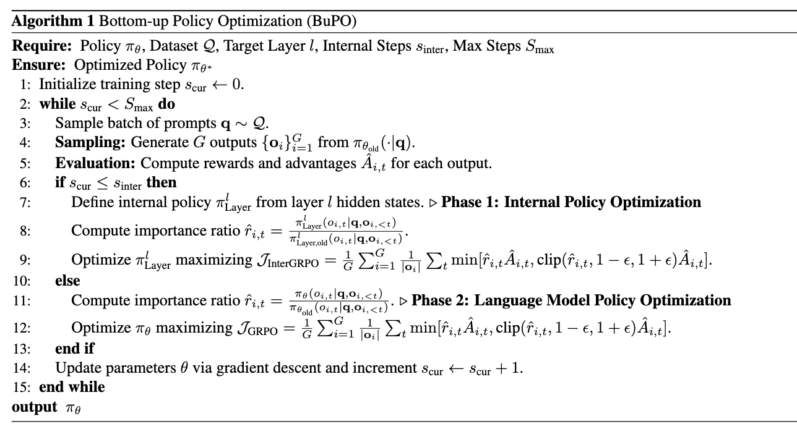

<h1 align="center">

    <br>
  <em>Bottom-up Policy Optimization:</em><br>
  Your Language Model Policy Secretly Contains Internal Policies
</h1>

## 👁 Overview
***Bottom-up Policy Optimization*** provides a novel framework to decompose LLM policies into internal layer and modular policies, reveals distinct reasoning patterns across different model architectures, and introduces a bottom-up optimization algorithm that leverages these insights to enhance complex reasoning.

<p align="center">
  
</p>
<p align="center">
  <sub>Detailed Implementation of the BuPO Algorithm</sub>
</p>


## 🤯 Key Findings:
- **Internal Policies**: Decomposes the unified LLM policy into samplable distributions from individual layers and modules (self-attention & FFN).
- **Progressive Reasoning Pattern**: Discovered a human-like "Exploration-Integration-Convergence" (EIC) pattern in Qwen models, contrasting with the abrupt convergence in Llama models.
- **Bottom-up Policy Optimization (BuPO)**: A novel two-phase RL algorithm that first optimizes an internal, lower-layer policy to reconstruct foundational reasoning, then fine-tunes the full model.
- **Enhanced Reasoning Performance**: BuPO significantly outperforms standard RL on complex reasoning benchmarks.

## 🚀 Code Release
The code and models for this project will be made publicly available within *one week*. Please stay tuned!

## 🙇‍♂️ Acknowledgement
We thank the <a href="https://github.com/volcengine/verl">verl</a> for their valuable contributions to the open-source community.

## ✍️ Citation
If you find our work helpful, please cite as:

```
```